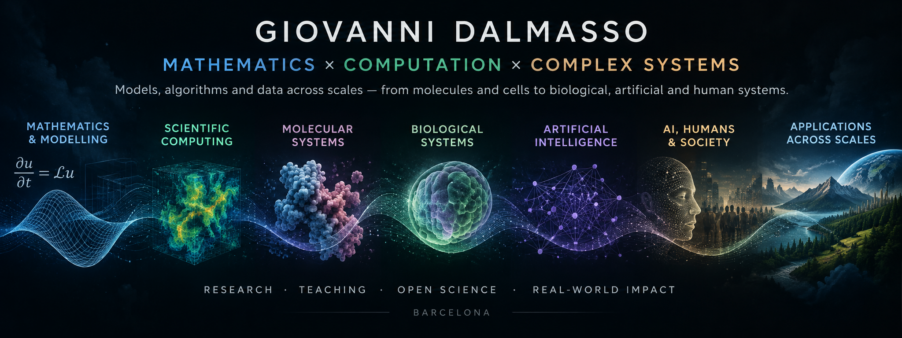

  

  
  &nbsp;
  
  &nbsp;
  
  &nbsp;
  
  &nbsp;
  

---

## I work across boundaries

I am a mathematician and computational scientist interested in how **mathematical models, simulation, data and computation** can help us understand complex systems.

My research crosses traditional disciplinary boundaries: from applied mathematics and molecular simulation to computational biology, artificial intelligence, scientific computing, human decision-making and questions at the intersection of **AI, ethics and society**.

Rather than being tied to a single application domain, I am especially interested in methods and ideas that **transfer across scales and disciplines**.

 

## Research landscape

<table>
<tr>
<td width="33%" valign="top">

### 🩵 ∂ Mathematics & modelling

Differential equations  
Stochastic processes  
Numerical methods  
Dynamical systems  
Mathematical modelling

</td>
<td width="33%" valign="top">

### 🌿 ◉ Scientific computing

Numerical simulation  
Algorithms  
Scientific visualization  
High-dimensional data  
Reproducible computation

</td>
<td width="33%" valign="top">

### 🪻 ⚛ Molecular systems

Molecular dynamics  
Molecular modelling  
Biomolecular interactions  
Multiscale simulation  
Computational biophysics

</td>
</tr>

<tr>
<td width="33%" valign="top">

### 🌱 ◌ Biological systems

Systems biology  
Morphogenesis  
Tissue development  
Population dynamics  
Multiscale biology

</td>
<td width="33%" valign="top">

### 💜 ⟡ Artificial intelligence

Machine learning  
Neural networks  
Data-driven modelling  
Scientific applications of AI  
Computational inference

</td>
<td width="33%" valign="top">

### 🧡 ◇ Humans, AI & society

Moral decision-making  
AI ethics  
Fairness & normative models  
Human–AI interaction  
AI & education

</td>
</tr>
</table>

Environmental and ecological systems also appear as application domains within this broader computational and mathematical framework.

 

## Selected work

<table>
<tr>
<td width="50%" valign="top">

### 🩵 [∂ Cálculo Diferencial en una Variable](https://github.com/gioda/calculo-diferencial-en-una-variable)

An open university mathematics project combining rigorous theory, extensive problem collections and computational resources.

</td>

<td width="50%" valign="top">

### 🌱 [◉ FeARLesS](https://github.com/gioda/FeARLesS)

4D reconstruction and analysis of developmental trajectories using spherical harmonics, connecting mathematical representations, scientific computing and biological morphogenesis.

</td>
</tr>

<tr>
<td width="50%" valign="top">

### 🪻 [∿ Lie splitting & correlated random walks](https://github.com/gioda/lie-splitting-correlated-random-walk)

Research at the intersection of stochastic modelling, numerical mathematics and computational simulation.

</td>

<td width="50%" valign="top">

### 🌿 [◈ vedo](https://github.com/marcomusy/vedo)

Open-source Python library for scientific analysis and visualization of 3D objects and data.

I am a **contributor** to the project and use it extensively across my own scientific work.

</td>
</tr>
</table>

 

## Beyond the repositories

Not all of my research lives on GitHub.

My broader work includes **molecular dynamics and biomolecular modelling, multiscale biological systems, machine learning, scientific visualization, mathematical and stochastic modelling, human moral decision-making, and the societal and educational implications of artificial intelligence**.

I am particularly drawn to problems where a method developed in one field unexpectedly becomes useful in another.

 

## Open science & education

I believe scientific and educational work becomes more valuable when it can be **inspected, reproduced, reused and improved**.

Alongside research, I develop open educational resources, computational teaching material and reproducible scientific workflows. Where possible, public projects include documented source material, explicit licensing, archival releases and persistent citations.

 

---

  
  
  
  
  
  

  <strong>Research · Teaching · Open Science</strong> 
  Barcelona

